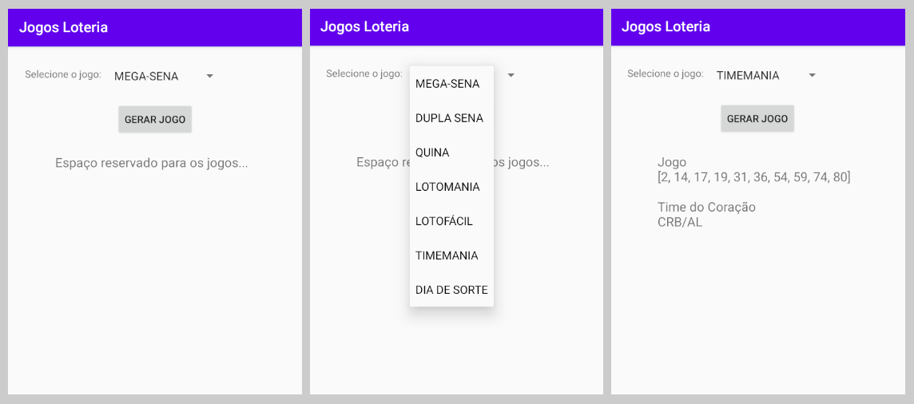

# Jogos Loteria

Este é um projeto Android nativo utilizando Kotlin.

## Screnshots

Como gerar um jogo

## Getting started

Para executar este projeto basta:

- Abrir no Android Developer Studio
- Executar o projeto um emulador ou no equipamento físico
